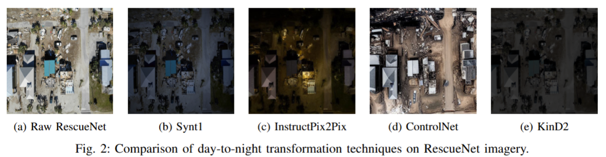

# Bridging the Nocturnal Data Gap via Cycle-Consistent Domain Translation for Illumination-Invariant Semantic Segmentation in UAV Disaster Imagery

Official repository for **II-DAMNet** (Illumination-Invariant Damage Assessment Model). This framework addresses the scarcity of annotated nighttime aerial imagery by using structure-preserving day-to-nocturnal domain translation to enable reliable, round-the-clock automatic post-disaster evaluation.

---

## 📌 Overview

Drones (UAVs) equipped with computer vision systems are crucial for minimizing response delays during natural disasters. However, their performance drops drastically at night due to a severe lack of annotated nocturnal data. 

This project bridges that gap by implementing two simulated datasets (**Twilight-style** and **Infrared-style**) derived from the daytime RescueNet dataset. By leveraging translation methods with strict cycle-consistency (physics-based **KinD2** and heuristic **Synt1** filters), we manipulate illumination maps and color temperatures without destroying the underlying geometric structures or invalidating original daytime segmentation masks.

### Key Highlights
* **Zero-Annotation Overhead:** Automatically expands existing daytime datasets into nocturnal domains without manual re-labeling.
* **Robust Under Extreme Shift:** Boosts mean Intersection over Union (mIoU) on challenging simulated infrared domains from **24.69%** (baseline PSPNet) to **60.40%**.
* **Consistent Cross-Domain Performance:** Maintains stable semantic accuracy across day, twilight, and infrared simulated scenarios (60.40%–66.40% mIoU).

---

## 🖼️ Visual Results & Domain Translation

### Day-to-Night Domain Translation
Below is a comparison of different day-to-nocturnal translation approaches evaluated on RescueNet imagery. Our framework prioritizes **Synt1** (twilight-style) and **KinD2** (infrared-style) due to their perfect structural preservation.

  
*Figure 1: Comparison of day-to-night transformation techniques (Synt1, InstructPix2Pix, ControlNet, KinD2).*

---

### Semantic Cycle-Consistency (Day ⇄ Night ⇄ Day)
To verify that structural fidelity and critical features are completely preserved across lighting changes, we evaluate a bidirectional cycle translation.

  
*Figure 2: Visual comparison of the bidirectional cycle transformations (Synt and KinD filters) on RescueNet imagery.*

---

### Segmentation Performance Comparison
Qualitative comparison mapping out how the baseline model fails under lighting shifts, while **II-DAMNet** successfully segments buildings and roads.

  
*Figure 3: Qualitative performance comparison between the baseline PSPNet and the proposed II-DAMNet across original daytime imagery and generated low-light domains.*

---

## 📊 Quantitative Performance Summary

### Evaluation across Disaster Lighting Scenarios (IoU % / mIoU)
Compared against the baseline PSPNet model on the grouped critical classes (*Intact Building*, *Damaged Building*, *Blocked Road*, and *Background*):

| Model | Original (Day) | Infrared-style | Twilight-style | Mixed Test Set |
| :--- | :---: | :---: | :---: | :---: |
| **PSPNet (Baseline)** | **74.41%** | 24.69% | 49.64% | 50.58% |
| **II-DAMNet (Ours)** | 66.40% | **60.40%** | **62.91%** | **61.71%** |

---
